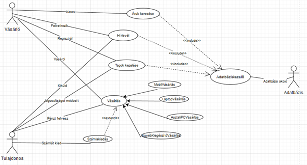
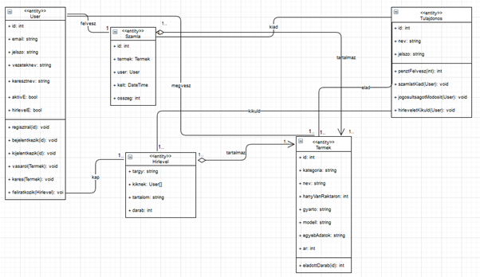
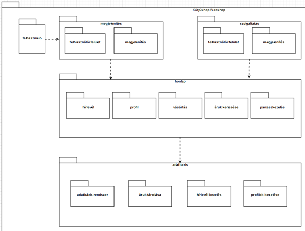
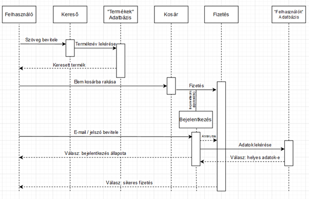

# MŰSZAKI DOKUMENTÁCIÓ: KUTYUSHOP WEBSHOP ALKALMAZÁS

## 1. Rendszerterv és technológiai specifikáció
A szoftver egy Java-alapú webes megoldás, amely a **Spring Boot** keretrendszert alkalmazza. A fejlesztés során a cél egy robusztus, könnyen bővíthető architektúra kialakítása volt a következő technológiai stack használatával:

* **Backend:** Java 17+, Spring Boot keretrendszer.
* **Adatbázis-kezelés:** Spring JDBC (`JdbcDaoSupport`), amely közvetlen SQL utasításokon alapuló adatkommunikációt biztosít.
* **Projektkezelés:** Maven build-rendszer (`pom.xml`).
* **Frontend:** MVC architektúra szerinti nézetkezelés (Thymeleaf/JSP alapú webes felületek).

## 2. Szoftverarchitektúra
Az alkalmazás logikai rétegekre tagolódik az átláthatóság és a karbantarthatóság érdekében:

* **Vezérlő réteg (Controller):** A `KutyushopController` osztály kezeli a beérkező HTTP kéréseket, végzi a nézetek közötti navigációt (pl. főoldal, kosár, fizetés), és közvetít a felhasználó és az adatbázis-logika között.
* **Adathozzáférési réteg (DAO):** A `UserDAO` és `TermekDAO` osztályok felelősek a perzisztens adattárolásért. A rendszer direkt SQL lekérdezéseket alkalmaz a maximális kontroll érdekében.
* **Adatmodell (Model):** A `User` és `Termek` entitások reprezentálják a rendszerben kezelt objektumokat.

## 3. Funkcionális jellemzők
A fejlesztés során az alábbi kulcsfontosságú üzleti funkciók kerültek implementálásra:

* **Dinamikus tartalomkezelés:** A kezdőlap inicializálásakor a rendszer automatikusan lekéri a kiemelt és akciós termékeket az adatbázisból ID alapján.
* **Felhasználókezelés (CRUD):**
    * Regisztráció és adatmentés a `felh` táblába.
    * Profiladatok frissítése és felhasználók törlése ID alapján.
* **Autentikációs modul:** E-mail cím és jelszó alapú ellenőrzés a beléptetéshez.
* **Webshop motor:** Különálló modulok a termékböngészéshez, kosárkezeléshez és a tranzakciók szimulálásához.

## 4. Adatbázis struktúra
A szoftver működéséhez két elsődleges tábla szükséges:

1.  **felh:** Felhasználói adatok, szállítási címek és hitelesítő adatok tárolása.
2.  **termek:** Termékinformációk, árak, kategóriák és raktárkészlet adatok.

## 5. Telepítési útmutató
Az alkalmazás futtatásához a következő lépések szükségesek:

1.  A forráskód letöltése és a `target` mappa kiürítése (Clean build).
2.  SQL adatbázis inicializálása a `pom.properties` és a DAO osztályok elvárásai szerint.
3.  Indítás a Maven Wrapper segítségével: `./mvnw spring-boot:run`
4.  A rendszer a `http://localhost:8080` porton válik elérhetővé.

## Use Case diagram

## Class diagram

## Package diagram

## Sequence diagram
